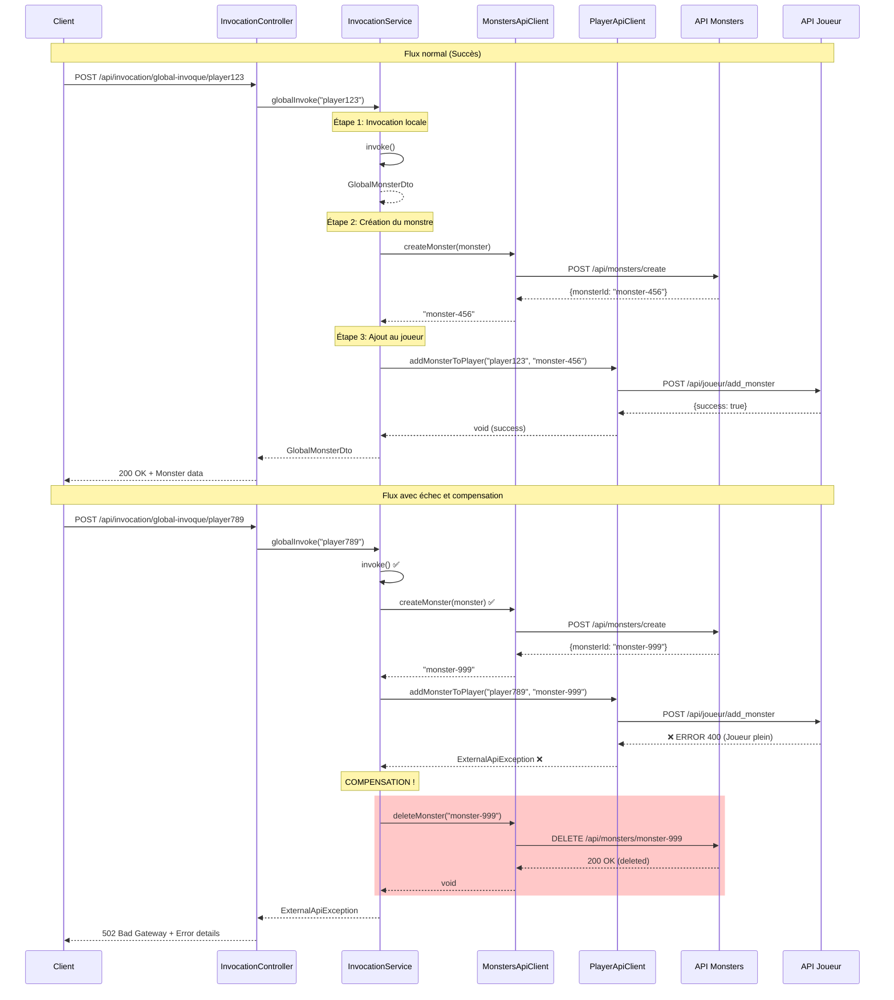

## Légende

- ✅ Opération réussie
- ❌ Opération échouée
- 🔄 Compensation (rollback)

## Cas d'usage couverts

### 1. Succès complet
Toutes les étapes se passent bien, le monstre est créé et ajouté au joueur.

### 2. Échec à l'étape 2 (API Monsters down)
L'invocation locale réussit, mais la création dans l'API Monsters échoue.
→ Pas de compensation nécessaire (monsterId = null)

### 3. Échec à l'étape 3 (API Joueur refuse)
Le monstre est créé dans l'API Monsters, mais l'ajout au joueur échoue.
→ **Compensation déclenchée** : suppression du monstre créé

### 4. Échec de la compensation
Si la suppression du monstre échoue aussi :
→ Log d'erreur, mais l'exception originale est quand même propagée
→ Permet de traiter manuellement les orphelins plus tard
